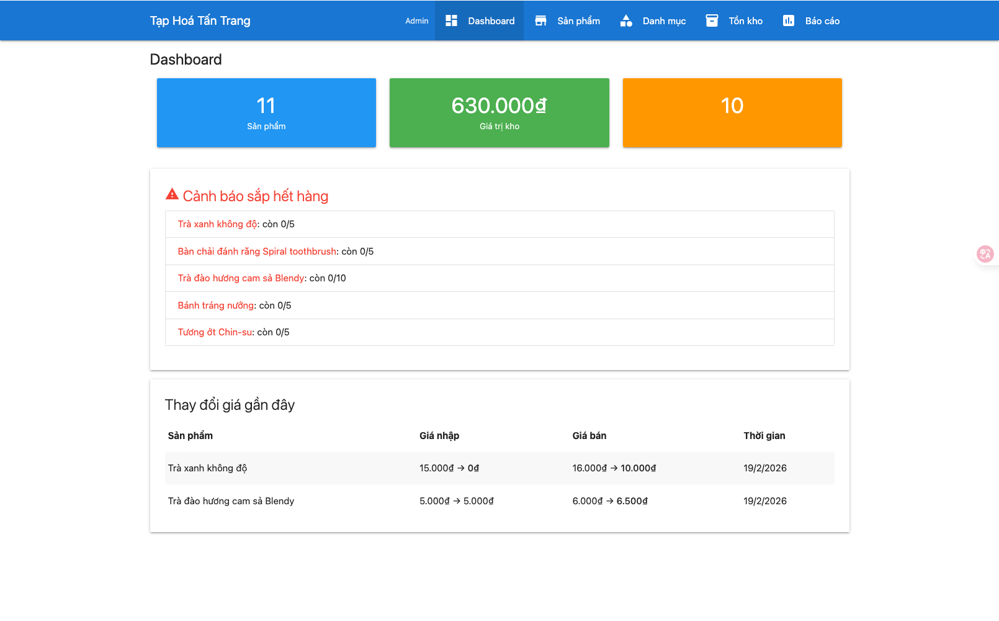
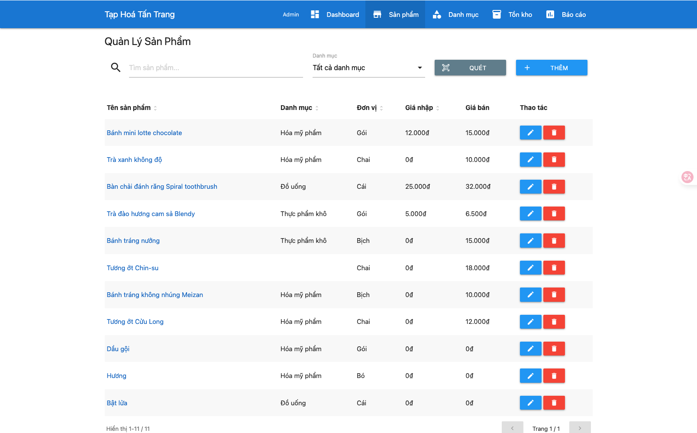
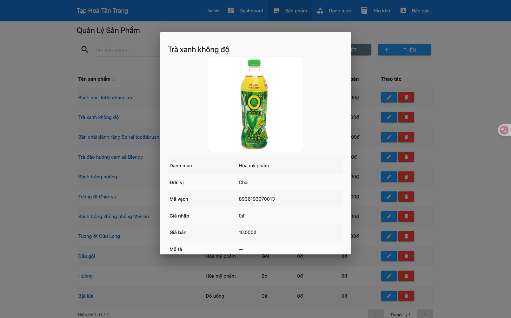
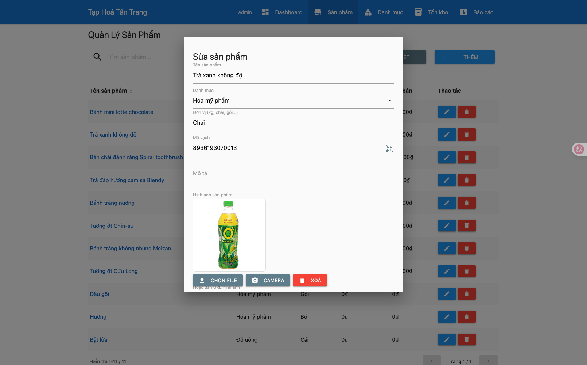
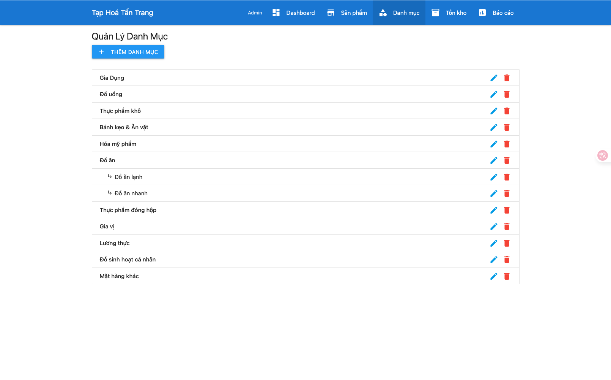
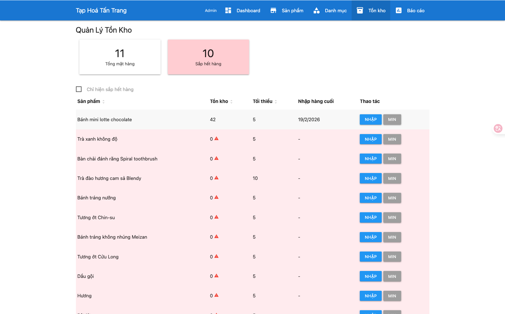
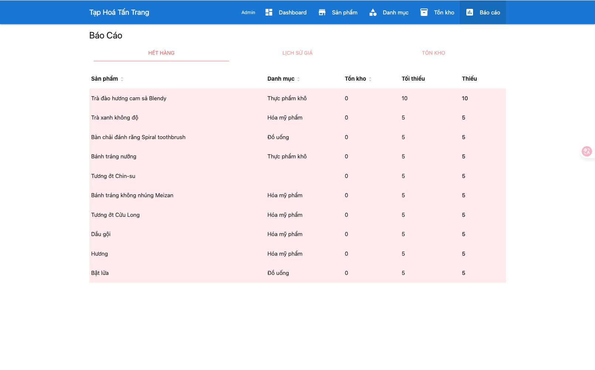
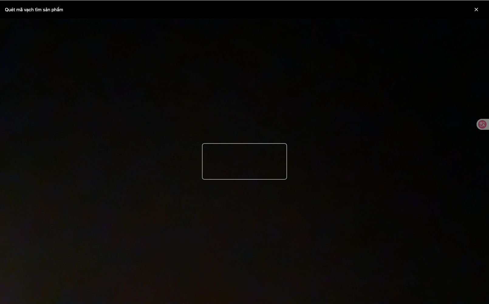

# Grocery Manager - Quản Lý Giá Sản Phẩm

[English](README.md)

Website quản lý giá sản phẩm cho tạp hoá (500-2000 SKU), full-stack trên Google Apps Script + Google Sheets.

## Ảnh Chụp Màn Hình

|                  Dashboard                   |                  Sản phẩm                  |
| :------------------------------------------: | :----------------------------------------: |
|  |  |

|                     Chi tiết sản phẩm                     |                    Form sản phẩm                    |
| :-------------------------------------------------------: | :-------------------------------------------------: |
|  |  |

|                   Danh mục                   |                  Tồn kho                   |
| :------------------------------------------: | :----------------------------------------: |
|  |  |

|                 Báo cáo                  |                     Quét Barcode                      |
| :--------------------------------------: | :---------------------------------------------------: |
|  |  |

## Tính Năng

- **Quản lý sản phẩm**: CRUD sản phẩm, tìm kiếm (theo tên/barcode/mô tả), lọc theo danh mục, xem chi tiết modal
- **Ảnh sản phẩm**: Upload/hiển thị ảnh sản phẩm qua Google Drive
- **Quét Barcode**: Quét barcode bằng camera thiết bị
- **Tìm giá Google**: Tìm giá sản phẩm trên Google từ modal chi tiết
- **Quản lý giá**: Cập nhật giá nhập/bán, tự động ghi lịch sử giá (bỏ qua nếu giá không đổi)
- **Quản lý danh mục**: Danh mục cha-con (2 cấp)
- **Tồn kho**: Quản lý tồn kho, cảnh báo sắp hết hàng, nhập hàng với ghi chú
- **Báo cáo**: Dashboard tổng quan, báo cáo sắp hết hàng, lịch sử giá, tổng hợp tồn kho
- **Bảng dữ liệu**: Sắp xếp cột, phân trang
- **Phân quyền**: Admin/viewer theo email
- **Tuỳ chỉnh**: Tên app thay đổi qua Script Properties (`APP_NAME`)

## Kiến Trúc

```
Browser SPA <-> google.script.run <-> GAS Backend <-> CacheService + Google Sheets (6 sheets)
                                                   └-> Google Drive (ảnh sản phẩm)
```

### Backend (`.gs`)

| File                | Mô tả                                           |
| ------------------- | ----------------------------------------------- |
| Config.gs           | Hằng số, tên sheet, ánh xạ cột                  |
| SheetHelper.gs      | Tiện ích CRUD chung cho Sheets                  |
| CacheHelper.gs      | CacheService wrapper với chunking (>100KB)      |
| Auth.gs             | Xác thực & phân quyền                           |
| Code.gs             | doGet(), include(), setupSheets(), API wrappers |
| ProductService.gs   | CRUD sản phẩm + tìm kiếm/lọc                    |
| PriceService.gs     | CRUD giá + tự động ghi lịch sử                  |
| CategoryService.gs  | CRUD danh mục với cây cha-con                   |
| InventoryService.gs | Quản lý tồn kho + cảnh báo sắp hết              |
| ImageService.gs     | Upload/phục vụ ảnh qua Google Drive             |
| ReportService.gs    | Thống kê dashboard + 3 loại báo cáo             |

### Frontend (`.html`)

| File            | Mô tả                                     |
| --------------- | ----------------------------------------- |
| index.html      | SPA shell với nav, routing                |
| app.js.html     | Router, state manager, API wrapper, utils |
| styles.css.html | Custom styles + responsive                |
| products.html   | Danh sách sản phẩm, tìm kiếm, modals      |
| categories.html | Cây danh mục, CRUD modals                 |
| inventory.html  | Bảng tồn kho, nhập hàng, mức tối thiểu    |
| dashboard.html  | Thẻ thống kê, cảnh báo sắp hết hàng       |
| reports.html    | 3 tab báo cáo với bộ lọc                  |

## Cài Đặt

### Yêu Cầu

- Node.js 14+
- pnpm

### 1. Cài Dependencies

```bash
pnpm install
```

### 2. Đăng Nhập & Tạo GAS Project

```bash
pnpm exec clasp login
pnpm exec clasp create --title "Grocery Manager" --type standalone --rootDir src
```

### 3. Chạy Setup

1. `pnpm open` để mở GAS editor
2. Chạy hàm `setupSheets()` — tạo 6 sheets với headers + thêm bạn làm admin

### 4. Deploy

```bash
pnpm run deploy    # push code + tạo deployment mới
```

### Các Scripts

| Script              | Mô tả                                      |
| ------------------- | ------------------------------------------ |
| `pnpm push`         | Push code lên GAS                          |
| `pnpm push:watch`   | Tự động push khi thay đổi file             |
| `pnpm run deploy`   | Push + tạo deployment với timestamp        |
| `pnpm open`         | Mở GAS editor trên trình duyệt             |
| `pnpm open:webapp`  | Mở web app đã deploy                       |
| `pnpm logs`         | Xem execution logs                         |
| `pnpm status`       | Kiểm tra trạng thái đồng bộ file           |
| `pnpm format`       | Format code với dprint                     |
| `pnpm format:check` | Kiểm tra format (không thay đổi)           |
| `pnpm lint`         | Lint file `.gs` với ESLint                 |
| `pnpm lint:fix`     | Tự động sửa lỗi lint                       |
| `pnpm check`        | Kiểm tra format + lint (dùng trước commit) |

## Cơ Sở Dữ Liệu (6 Sheets)

- **Products**: id, name, category_id, unit, barcode, description, image_id, status, created_at, updated_at
- **Prices**: id, product_id, buy_price, sell_price, updated_at, updated_by
- **Inventory**: id, product_id, quantity, min_stock, last_restock, updated_at
- **PriceHistory**: id, product_id, old_buy, new_buy, old_sell, new_sell, changed_at, changed_by
- **Users**: email, name, role, created_at
- **Categories**: id, name, parent_id, created_at

## Phân Quyền

- **admin**: Toàn quyền CRUD
- **viewer**: Chỉ xem (ẩn nút sửa/xóa, server kiểm tra)

## Giới Hạn

- GAS execution limit: 6 phút
- API rate: 100 requests/100s/user
- CacheService: 100KB/key (xử lý bằng chunking)
